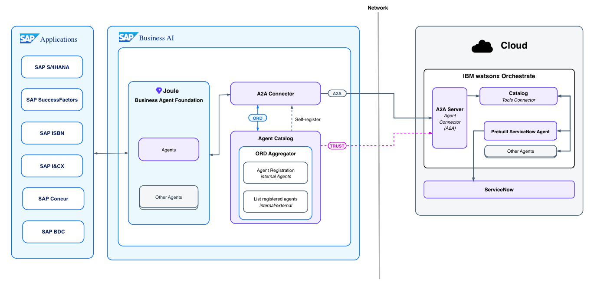

# AI165 - Interconnect custom AI agents with your cloud and partner ecosystem

This repository contains the material for the SAP TechEd 2025 session called AI165 - Interconnect custom AI agents with your cloud and partner ecosystem.

## Goal formulation for this hands-on
At the end of the session, you yourself will have:
- Built a custom Agent in Joule Studio
- Attached Tools as Joule Skills to integrate it with an external partner Agent from IBM
- Used the Agent2Agent (A2A) protocol for the communication between the Agents
- Invoked your Agent from within Joule (SAP's AI Copilot) as the entry point

## The scenario: Business Partner Invoicing Agent

> [!IMPORTANT]
> The Business Partner Invoicing Agent described here doesn’t exist and is purely a fictional concept created for a hands-on session scenario.

In this hands-on session, we'll work with a **fictional** "Business Partner Invoicing" scenario where companies send due invoices to their business partners for payment. The scenario demonstrates how two AI agents collaborate seamlessly to handle invoicing workflows that would traditionally require manual intervention across multiple systems.

Two **agents** work together to complete user tasks. The first is SAP's "Business Partner Invoicing Agent," which runs on **SAP BTP** and includes multiple attached tools. Users interact exclusively with this SAP agent to send invoices to business partners and retrieve business partner information. The second is IBM's "**ServiceNow** Ticketing Agent," invoked through **IBM watsonx Orchestrate** in the cloud. These agents communicate using the standardized Agent2Agent (**A2A**) protocol.

When users request to send an invoice to a business partner that doesn't exist in the system, the SAP agent asks if it should create a new business partner record. If approved, the SAP agent automatically collaborates with the IBM agent to generate a ServiceNow ticket for business partner creation. This eliminates workflow bottlenecks and ensures smooth invoicing processes without requiring users to switch between systems or handle manual workarounds.

### Architecture Diagram
(maybe we should add 1-2 sentences here, describing the architecture)

### Demo
(add a demo video or maybe a demo gif. during the hands-on session we can think of doing a quick live demo)

## Outline - TO BE REMOVED

### Introduction to Session
- What is an Agent? Difference to Algorithm, Chain,...
- Joule Studio Agent Builder
- A2A high level information => strategy?
- Scenario description(s): (1), (2), (3)
- Architecture/Demo

### Hands-on Part

#### 1. Build an Agent
- How to
- Trace of Agent's steps

#### 2. Agent x A2A: Add A2A support to Agent
- What benefits does A2A bring?
- What is an Agent Card? Discoverability? => Show IBM & SAP Agent Cards
- A2A Client => Call A2A Agent Server

#### 3. Let the Agents collaborate w/ A2A (across borders)!
- Use Built Agent (Step (1) and (2))
- Deployed A2A Agents (SAP & IBM)
- Trace of collaboration (Orchestrator?)
- Setup via Terraform (optional)

## Requirements

The requirements to follow the exercises in this repository are...

## Exercises

- [Terms and Definitions](exercises/ex0/README.md)
- [Exercise 1 - First Exercise Description](exercises/ex1/)
    - [Exercise 1.1 - Exercise 1 Sub Exercise 1 Description](exercises/ex1#exercise-11-sub-exercise-1-description)
    - [Exercise 1.2 - Exercise 1 Sub Exercise 2 Description](exercises/ex1#exercise-12-sub-exercise-2-description)
- [Exercise 2 - Second Exercise Description](exercises/ex2/)
    - [Exercise 2.1 - Exercise 2 Sub Exercise 1 Description](exercises/ex2#exercise-21-sub-exercise-1-description)
    - [Exercise 2.2 - Exercise 2 Sub Exercise 2 Description](exercises/ex2#exercise-22-sub-exercise-2-description)

## Contributing
Please read the [CONTRIBUTING.md](./CONTRIBUTING.md) to understand the contribution guidelines.

## Code of Conduct
Please read the [SAP Open Source Code of Conduct](https://github.com/SAP-samples/.github/blob/main/CODE_OF_CONDUCT.md).

## How to obtain support

Support for the content in this repository is available during the actual time of the online session for which this content has been designed. Otherwise, you may request support via the [Issues](../../issues) tab.

## License
Copyright (c) 2024 SAP SE or an SAP affiliate company. All rights reserved. This project is licensed under the Apache Software License, version 2.0 except as noted otherwise in the [LICENSE](LICENSES/Apache-2.0.txt) file.
