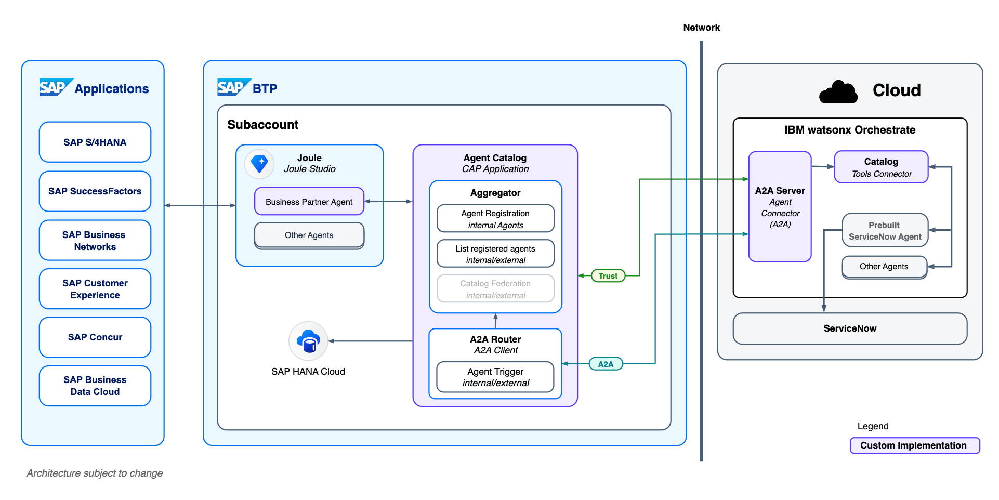

# AI165 - Interconnect custom AI agents with your cloud and partner ecosystem

This repository contains the material for the SAP TechEd 2025 session called AI165 - Interconnect custom AI agents with your cloud and partner ecosystem.

## Goal formulation for this hands-on
At the end of the session, you yourself will have:
- Built a custom Agent in Joule Studio
- Attached Tools as Joule Skills to integrate it with an external partner Agent from IBM
- Used the Agent2Agent (A2A) protocol for the communication between the Agents
- Invoked your Agent from within Joule (SAP's AI Copilot) as the entry point

## The scenario: Business Partner Invoicing

> [!IMPORTANT]
> The Business Partner Invoicing Agent described here doesn’t exist and is purely a fictional concept created for a hands-on session scenario.

In this hands-on session, we will work with a **fictional** Business Partner Invoicing scenario in which your company's business partners send invoices for services they have provided. Assume the invoices have been sent via email, for example. The invoice then needs to be attached to the corresponding business partner record in SAP S/4HANA so that it can be paid later. The Business Partner Invoicing Agent assists you with this task and is able to:

1. Provide information about business partners from the records of known business partners
2. Create tickets in ServiceNow to add new business partners to the records
3. Attach an invoice to the business partner record in SAP S/4HANA (simulated)

To build custom agents like the one described above, you use **Joule Studio**, a capability within SAP Build, and its new built-in Agent Builder. You can either attach one of the out-of-the-box tools to an agent or build your own using Joule Skills. The latter can also be used for agent collaboration, where an agent collaborates with another (external) agent. **Joule**, SAP's AI Copilot, can then leverage your custom agents and their skills to complete designated tasks.

In this scenario, you as the end user interact only with the Business Partner Invoicing Agent, which maintains knowledge about the business partners. However, if the agent cannot find the business partner in question, it collaborates with IBM's **ServiceNow** Ticketing Agent (invoked via **IBM watsonx Orchestrate** in the cloud) in the background to open a ServiceNow ticket requesting business partner creation.

IBM watsonx Orchestrate is IBM’s open platform for building, managing, observing, and governing AI agents. In addition to its low-code and pro-code agent development capabilities, it also provides a catalog of prebuilt agents that simplify access to AI tools from various domains like Human Resources, Sales, Procurement, and Customer Care. This workshop leverages the latter, integrating ServiceNow customer care capabilities like ticket management.
Reference: https://www.ibm.com/docs/en/watsonx/watson-orchestrate/base

Note that the two agents communicate using the Agent2Agent (**A2A**) protocol to facilitate agent interoperability. This workflow minimizes manual work and accelerates the storage and processing of invoices that your company must pay.

### Architecture Diagram
(maybe we should add 1-2 sentences here, describing the architecture)

### Demo
(add a demo video or maybe a demo gif. during the hands-on session we can think of doing a quick live demo)

## Requirements
There are only a few requirements to follow the exercises. Everything will already be installed on the machine provided for the live hands-on session. You will also be given access to Joule Studio and its Agent Builder.

- A Chromium-based browser (e.g., Google Chrome)
- Node.js v22.17.0 (LTS)
- A text editor, such as VS Code
- Access to Joule Studio and its Agent Builder

## Exercises

- [Terms and Definitions](exercises/ex0/README.md)
- [Exercise 1 - Build Your First Agent in Joule Studio](exercises/ex1/README.md)
- [Exercise 2 - Discover and Invoke Agent via A2A](exercises/ex2/README.md)
- [Exercise 3 - Agent Collaboration via A2A](exercises/ex3/README.md)

## Contributing
Please read the [CONTRIBUTING.md](./CONTRIBUTING.md) to understand the contribution guidelines.

## Code of Conduct
Please read the [SAP Open Source Code of Conduct](https://github.com/SAP-samples/.github/blob/main/CODE_OF_CONDUCT.md).

## How to obtain support

Support for the content in this repository is available during the actual time of the online session for which this content has been designed. Otherwise, you may request support via the [Issues](../../issues) tab.

## License
Copyright (c) 2024 SAP SE or an SAP affiliate company. All rights reserved. This project is licensed under the Apache Software License, version 2.0 except as noted otherwise in the [LICENSE](LICENSES/Apache-2.0.txt) file.
